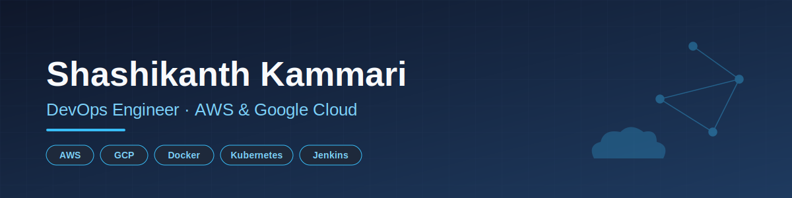

<h1 align="center">Hi 👋, I'm Shashikanth Kammari</h1>
<h3 align="center">DevOps Engineer | AWS & Google Cloud</h3>

  

  

- 🔭 I'm currently working at [Tata Consultancy Services](https://www.tcs.com/)

- 🌱 I'm currently leveling up my **AWS DevOps Engineer** skills

- 👨‍💻 Check out all my projects at [github.com/Shashikanth-Kammari](https://github.com/Shashikanth-Kammari)

- 💬 Ask me about **CI/CD pipelines, cloud infrastructure (AWS/GCP), containerization, and building reliable deployment workflows**

- 🤝 I enjoy collaborating with development, IT operations, and QA teams to ship software faster and more reliably

- 📫 Reach me at **shashikanth0312@gmail.com**

- 📄 Resume: [Kammari Shashikanth Chary - SDE.pdf](./Kammari%20Shashikanth%20Chary%20-%20SDE.pdf)

### Blog Posts
<!-- BLOG-POST-LIST:START -->
<!-- BLOG-POST-LIST:END -->

<h3 align="left">Connect with me:</h3>

<h3 align="left">Languages and Tools:</h3>

&nbsp;

